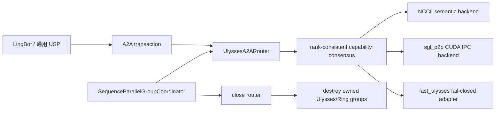

# event_test3 Ulysses A2A backend 设计与适配记录

状态：实现候选，尚未完成生产环境复验
本地基线：`event_test3@3fc065f99cd6e12e81861c9847d46025f959a895`
实现分支：`codex/event-test3-ulysses-a2a-backend`
模型目标：LingBot World fast diffusers
更新时间：2026-07-23

## 1. 目标与边界

目标是在不改变默认 NCCL 行为的前提下，为 diffusion Ulysses
sequence parallel 引入可选择、可观测、可正确销毁的 A2A backend：

- `nccl`：语义基线和永久兜底；
- `sgl_p2p`：复用 SGLang kernel wheel 中的 CUDA IPC/NVLink kernel；
- `fast_ulysses`：预留 adapter，但在缺少安全 reclaim 契约时严格拒绝启动；
- `auto`：逐次按语义、设备、拓扑和 rank 一致性选择 P2P，否则回退 NCCL。

当前版本有意不实现：

- variable-split P2P；
- 多节点 P2P；
- grouped async Q/K/V；
- transaction 中途切换 backend；
- 未验证的 `fast_ulysses` borrowed-buffer 重用。

因此 `--ulysses-a2a-qkv-overlap` 默认必须为 `off`。`fast_ulysses`
即使已安装也会 fail closed，直到 binding 提供经过验证的跨 rank、
stream-ordered slot reclaim。

## 2. 为什么不能继续使用原来的模块全局对象

原 `event_test3` 路径由 `usp.py` 直接调用
`get_ulysses_p2p_a2a(group, device)`，后者以 `id(group)` 为 key 保存模块级
`_INSTANCES`。这会造成四个问题：

1. model 层同时承担语义变换和 transport 选择；
2. process group 销毁后，全局对象仍可能持有 CUDA IPC pointer；
3. P2P capability miss 由单 rank 本地决定，存在 collective 分叉风险；
4. 一次 attention 的 Q/K/V/OUT 可能在不同调用上选到不同 backend。

新设计由 `SequenceParallelGroupCoordinator` 持有唯一 router。router 在第一次
A2A 时延迟创建，并且必须在 Ulysses/Ring subgroup 销毁前关闭。

## 3. 架构



核心目录：

```text
python/sglang/multimodal_gen/runtime/distributed/
├── device_communicators/
│   ├── ulysses_a2a/
│   │   ├── base.py
│   │   ├── nccl.py
│   │   ├── router.py
│   │   └── fast_ulysses.py
│   └── ulysses_p2p_a2a.py
├── group_coordinator.py
├── parallel_groups.py
└── parallel_state.py
```

### 3.1 语义 API

调用方只表达 Ulysses 语义：

```python
transaction.input_all_to_all(
    tensor,
    head_dim=2,
    seq_lens=None,
    slot=A2ASlot.PACKED_QKV,
)
transaction.output_all_to_all(
    tensor,
    head_dim=2,
    slot=A2ASlot.OUT,
)
```

`A2ASpec` 冻结以下路由输入：

- input/output mode；
- shape、dtype、device；
- head dimension；
- uniform 或 variable split；
- CUDA graph capture 状态；
- Q/K/V/PACKED_QKV/OUT semantic slot。

transaction 第一次调用后固定 backend。后续调用若不再满足该 backend 的能力
契约，会报错并停止，而不是在 collective 已开始后回退。

### 3.2 NCCL backend

NCCL adapter 完整承接原 `usp.py` 的四种语义：

- uniform input；
- uniform output；
- variable input；
- variable output。

这样 model-facing `usp.py` 只负责委托，原 layout 变换集中在一个基线 backend
中。默认 backend 为 `nccl`，所以未配置的新部署不启用 P2P。

### 3.3 sgl_p2p backend

P2P V1 只接受：

- CUDA 4D tensor；
- FP16、BF16 或 FP32；
- world size 2、4、6、8；
- `head_dim=2`；
- uniform split；
- 单机、完整 NVLink/P2P topology；
- 非 CUDA graph capture。

一个 communicator 只有一组 signal/output staging buffer，所以
`max_inflight=1`。每次 launch 在当前 stream 记录 CUDA event，下一次 launch
等待前一次 event；grow 或 close 前同步最后一个 event。

buffer grow 在所有 rank 上先比较请求字节数的 MIN/MAX。请求不一致直接报
`UlyssesA2ACommitError`，避免不同 rank 进入不同的 allocation collective。

能力检查发生在共享内存分配前。signal/output allocation 一旦开始，后续异常
属于 post-commit failure，禁止回退 NCCL。

### 3.4 rank 一致性

router 初始化时对以下 config 做 `all_gather_object`：

```text
backend, transfer, qkv_overlap, p2p_tk_style, legacy_prefer_p2p
```

每个新的 `A2ASpec.signature` 也执行一次 route consensus，并按 signature 缓存。
决策规则：

- descriptor 和 capability 全一致且支持：选择 P2P；
- 全 rank 以同一原因不支持：`auto` 回退 NCCL；
- variable split：允许 local shape 不同，但固定排除 P2P；
- descriptor 不一致：拒绝 unsafe NCCL fallback；
- capability 有的 rank 支持、有的不支持：统一回退，禁止 rank 分叉。

CUDA graph capture 不执行 selector control collective。capture spec
确定性排除 P2P，并走 NCCL；router 和 route cache 应在 capture 前 warm up。

## 4. 模型接入

### 4.1 LingBot

LingBot 保留原有 packed QKV 设计：

```text
[Q | K | V] -- one INPUT A2A --> chunk(3) --> attention
attention output -- one OUTPUT A2A --> local sequence
```

这两次调用处于同一个 transaction，slot 分别为 `PACKED_QKV` 和 `OUT`。
variable sequence split 仍由 NCCL adapter 处理。

### 4.2 通用 USP

通用 attention 的 Q、K、V、OUT 使用显式 slot，并放入同一个 transaction。
这还不是 grouped async；它只建立 backend 一致性和未来 async API 的边界。

## 5. 生命周期与 CUDA IPC

`SequenceParallelGroupCoordinator.destroy()` 的顺序固定为：

1. router close；
2. P2P 等待最后一个 CUDA event；
3. 两次 subgroup barrier 之间释放 kernel state 和共享 buffer；
4. 销毁 owned Ulysses/Ring subgroup；
5. 清空 `PROCESS_GROUP` singleton；
6. 调用通用 coordinator destroy。

原 `CustomAllreduce.free_shared_buffer()` 只 `cudaFree` 本 rank allocation，没有
关闭其他 rank 的 `cudaIpcOpenMemHandle` mapping。本实现新增
`cudaIpcCloseMemHandle` binding，并在 free 时先关闭所有 peer pointer，再释放
本地 pointer。调用必须传入创建 buffer 时的准确 process group。

## 6. LingBot FP8_DYNAMIC loader

LingBot checkpoint 使用 compressed-tensors 的 `float-quantized` 格式。本分支为
diffusion linear/parameter 类型增加窄适配，只接受：

- FP8 weight；
- static、symmetric、per-output-channel weight scale；
- dynamic、symmetric、per-token activation scale；
- 无 output activation quantization；
- 无 sparsity 或 KV-cache scheme。

其他格式在 config 解析时立即失败，不能静默选择错误 kernel。该 adapter 复用
SRT 的 `CompressedTensorsW8A8Fp8` compute path，但用 diffusion 的
`ModelWeightParameter` 和 `ChannelQuantScaleParameter` 创建权重。

`compressed-tensors` 和 `addict` 已属于 SGLang Python 包依赖；生产环境应按本
分支安装 SGLang，而不是单独复制源码文件。

## 7. 配置优先级

优先级为：

```text
显式 CLI > 新环境变量 > 旧环境变量映射 > nccl
```

CLI：

```text
--ulysses-a2a-backend nccl|sgl_p2p|fast_ulysses|auto
--ulysses-a2a-transfer auto|sm|tma|ce
--ulysses-a2a-qkv-overlap off|auto|on
```

新环境变量：

```text
SGLANG_ULYSSES_A2A_BACKEND
SGLANG_ULYSSES_A2A_TRANSFER
SGLANG_ULYSSES_A2A_ASYNC_QKV
```

旧 `SGLANG_ENABLE_ULYSSES_P2P_A2A=1` 映射为 `auto`，同时保留
`legacy_prefer_p2p` 观测信息。`LINGBOT_FORCE_P2P=0` 或
`LINGBOT_ULYSSES_JIT=0` 在旧模式下是 veto；与旧 enable flag 冲突时启动失败。
显式 CLI 会覆盖这些旧 flag。

推荐 8 卡生产候选参数：

```bash
sglang serve \
  --model-path /home/admin/lingbot-world-fast-diffusers \
  --num-gpus 8 \
  --tp-size 1 \
  --sp-degree 8 \
  --ulysses-degree 8 \
  --ring-degree 1 \
  --ulysses-a2a-backend auto \
  --ulysses-a2a-qkv-overlap off
```

若希望强制验证 P2P，把 `auto` 改为 `sgl_p2p`。强制模式遇到不支持的 shape、
wheel 或 topology 会让请求失败，适合验收，不建议作为首次生产灰度配置。

kernel wheel 必须暴露：

```text
init_ulysses_a2a
dispose_ulysses_a2a
ulysses_a2a
ulysses_a2a_tk
meta_size
```

## 8. 验证状态

### 8.1 当前本地分支

本地 macOS 环境已完成：

- `git diff --check`；
- 目标文件 `compileall`；
- 目标文件 Ruff。

本机没有 CUDA/NVLink，也没有完整 production Python 依赖，因此不能把本地
结果当作多 rank、模型或性能验收。

### 8.2 上次远端实验的参考证据

本次实现从上次远端实验留下的源码快照恢复。以下结果只作为复验目标；原远端
环境和 Git branch 已丢失，不能替代当前分支的新生产验收：

- NCCL correctness：W2/W4/W8 通过；
- P2P legacy/TK correctness：W2/W4/W6/W8 通过；
- rank fault consensus、overlapping subgroup、post-commit fail-stop 通过；
- CUDA graph：capture 走 NCCL，teardown 前 reset graph；
- fixed-PG P2P memory soak：修复 IPC close 后增量为 0；
- LingBot W4 paired output hash 一致；
- W8 只完成 backend correctness，没有完成模型 E2E；
- L20X microbenchmark：
  - packed `[1,64,40,384]`：NCCL 0.07984 ms，P2P 0.03362 ms；
  - output `[1,256,10,128]`：NCCL 0.07196 ms，P2P 0.03323 ms。

whole model-parallel process-group 重建仍观察到约 1313 MiB/cycle 的 NCCL
增长；对照 backend 同样存在，不能归因于本 backend，但上线前仍需单独处理或
接受进程不做热重建的部署约束。

### 8.3 生产前必跑

1. 在最终镜像中运行 `scripts/ulysses_a2a/run_static_checks.sh`；
2. 检查 8 卡 topology 和 kernel symbols；
3. W2/W4/W8 NCCL semantic correctness；
4. W2/W4/W6/W8 P2P legacy/TK correctness；
5. rank-skew、post-commit、subgroup reinit、CUDA graph；
6. 固定模型、prompt、seed、resolution 的 NCCL/P2P paired hash；
7. 至少 30 分钟 realtime soak，记录 p50/p95、显存斜率和 fallback reason；
8. `auto` 小流量灰度；任何 mismatch、hang、strict violation 或持续显存增长均
   回滚到 `--ulysses-a2a-backend nccl`。

## 9. 验收标准

- 默认 `nccl` 与基线 raw-bit/layout 一致；
- 所有 rank 对 backend 和 spec 得到一致决策；
- P2P 不支持时，`auto` 只能在 preflight 阶段回退；
- post-commit failure 不允许转入另一 collective；
- router 在 subgroup 前关闭，peer IPC mappings 全部关闭；
- LingBot packed QKV 仍是一笔 input transaction；
- FP8_DYNAMIC checkpoint 能加载，非目标格式 fail closed；
- 8 卡模型 paired output 一致且 realtime soak 无 hang/leak；
- P2P 在目标 trace 上有可重复收益，否则生产保持 NCCL。
